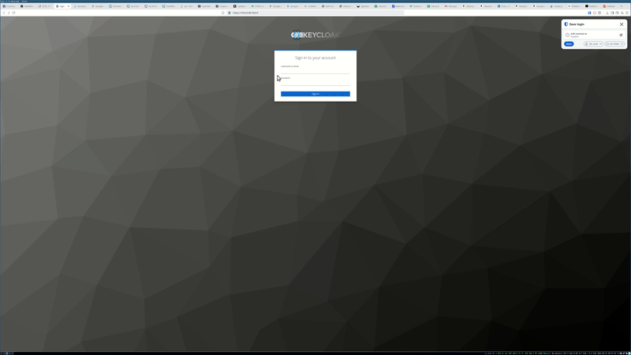

# Securing Wazuh: A Guide to Keycloak OAuth2 & MFA Integration

If you're running Wazuh in an environment with compliance requirements like **PCI DSS**, **SOC 2**, or **HIPAA**, you know that **multi-factor authentication (MFA)** and strict access control are non-negotiable. The need to prove who has access to sensitive security logs—and who can modify configurations—means that shared accounts and simple passwords are no longer enough.

It's time to connect Wazuh to a modern authentication provider. This guide will walk you through integrating Wazuh with **Keycloak**, a powerful open-source Identity and Access Management (IAM) solution.

Connecting Keycloak to Wazuh accomplishes two key goals:

1.  **Elevates Security & Compliance**: It immediately brings Wazuh's authentication up to modern standards with support for SSO, MFA, and centralized user management.
2.  **Improves Usability**: It allows you to grant role-based access to more people on your team, like developers and analysts, without managing separate credentials for each tool. By centralizing identity, everyone can log in and view the alerts relevant to them securely.

-----

## flow
notice the default wazuh login is replaced with keycloak direct





## Step 1: Deploying Keycloak with Docker Compose

There are many ways to set up Keycloak, including Helm charts for Kubernetes. For this guide, we'll use a simple `docker-compose` file to get a server running quickly. This setup includes a PostgreSQL database for persistence.

Create a file named `docker-compose.yml`:

```yaml
version: '3.8'

services:
  postgres:
    image: postgres:16.2
    volumes:
      - postgres_data:/var/lib/postgresql/data
    environment:
      POSTGRES_DB: ${POSTGRES_DB}
      POSTGRES_USER: ${POSTGRES_USER}
      POSTGRES_PASSWORD: ${POSTGRES_PASSWORD}
    networks:
      - keycloak_network

  keycloak:
    image: quay.io/keycloak/keycloak:23.0.6
    command: start
    environment:
      KC_HOSTNAME: localhost
      KC_HOSTNAME_PORT: 8080
      KC_HOSTNAME_STRICT_BACKCHANNEL: 'false'
      KC_HTTP_ENABLED: 'true'
      KC_HOSTNAME_STRICT_HTTPS: 'false'
      KC_HEALTH_ENABLED: 'true'
      KEYCLOAK_ADMIN: ${KEYCLOAK_ADMIN}
      KEYCLOAK_ADMIN_PASSWORD: ${KEYCLOAK_ADMIN_PASSWORD}
      KC_DB: postgres
      KC_DB_URL: jdbc:postgresql://postgres/${POSTGRES_DB}
      KC_DB_USERNAME: ${POSTGRES_USER}
      KC_DB_PASSWORD: ${POSTGRES_PASSWORD}
    ports:
      - "8080:8080"
    restart: always
    depends_on:
      - postgres
    networks:
      - keycloak_network

volumes:
  postgres_data:
    driver: local

networks:
  keycloak_network:
    driver: bridge
```

This `docker-compose.yml` file references environment variables for your secrets. Create a `.env` file in the same directory to store them:

```
# .env file
POSTGRES_DB=keycloak
POSTGRES_USER=keycloak
POSTGRES_PASSWORD=your_strong_postgres_password

KEYCLOAK_ADMIN=admin
KEYCLOAK_ADMIN_PASSWORD=your_strong_admin_password
```

Now, launch Keycloak by running:

```bash
docker-compose up -d
```

You should be able to access the Keycloak admin console at `http://localhost:8080`.

-----

## Step 2: Configuring the Keycloak Realm for Wazuh

Setting up Keycloak is the easy part. Now we need to configure it to act as an authentication provider for Wazuh. This involves creating a client, roles, and groups.

1.  **Create a Client**: In the Keycloak admin console, create a new client for Wazuh. Let's call the **Client ID** `wazuh`. Ensure the client has **Standard flow** enabled and add your Wazuh dashboard URL to the **Valid Redirect URIs** (e.g., `https://your-wazuh-host.com/*`).


3.  **Create Groups**: Using groups is the best way to manage user permissions. Go to **Groups** and create groups that mirror the roles:

      * `security_analytics_full_access`
      * `security_analytics_read_access`
      * `admin`  This groups are already in Keycloak and adding user to it will make them Admin in wazzu. Start be using you admin account in keycloak to login to wazuh 


> **Shortcut**: To make this easier, I have exported my Keycloak realm setup. You can download the `wazuh-keycloak.json` file and import it into your Keycloak instance.

-----

## Step 3: Configuring Wazuh to Use Keycloak


We need to make 3 steps to make wazuh work with keycloak

1. Setup the dashboard so it used keycloak and send you to login at the righ place
2. Setup the indexer so it gets the user from keycloak and can map the roles and more
3. Run a tool called secureadmin to update the index in opensearch with the settings (This will be depricade )

It's time to tell Wazuh to use Keycloak for authentication. This is done by editing the OpenSearch Dashboards configuration file.


### Dashboard

SSH into your Wazuh server and edit `/etc/wazuh-dashboard/opensearch_dashboards.yml`.

> **Important**: Before editing, make a backup of this file\!
> `cp /etc/wazuh-dashboard/opensearch_dashboards.yml /etc/wazuh-dashboard/opensearch_dashboards.yml.bak`

```yaml
# /etc/wazuh-dashboard/opensearch_dashboards.yml
opensearch_security.auth.type: "openid"
opensearch_security.openid:
  connect_url: "http://YOUR_KEYCLOAK_IP:8080/realms/master/.well-known/openid-configuration"
  client_id: "wazuh"
  client_secret: "YOUR_CLIENT_SECRET_FROM_KEYCLOAK" # Find this in your 'wazuh' client credentials tab
  scope: "openid profile email"
```

  * Update the `connect_url` to point to your Keycloak server's IP or hostname.
  * Retrieve your `client_secret` from the **Credentials** tab of your `wazuh` client in Keycloak.

After saving the file, restart the Wazuh dashboard to apply the changes:

```bash
systemctl restart wazuh-dashboard
```

-----

### Indexer 


Open the file config.yml in opensearch-security and add the settings for the openid. You also need to update the settings for basic_internal_auth_domain

```yaml
      config:
        dynamic:
          http:
            anonymous_auth_enabled: false
            xff:
              enabled: false
              internalProxies: '192\.168\.0\.10|192\.168\.0\.11' # regex pattern

          authc:
            basic_internal_auth_domain:
              description: "Authenticate via HTTP Basic against internal users database"
              http_enabled: true
              transport_enabled: true
              order: 0
              http_authenticator:
                type: basic
                challenge: false
              authentication_backend:
                type: intern
            openid_auth_domain:
                http_enabled: true
                transport_enabled: true
                order: 1
                http_authenticator:
                    type: openid
                    challenge: true
                    config:
                      subject_key: preferred_username
                      roles_key: groups
                      openid_connect_url: http://YOUR_KEYCLOAK_IP:8080/realms/master/.well-known/openid-configuration
                      required_audience: wazuh
                authentication_backend:
                  type: noop
```


Run the command on the indexer to poplate the index.
Im running in docker containers so plase modifi the path to cert and you configt to map your settings


```bash
export JAVA_HOME=/usr/share/wazuh-indexer/jdk/ && bash /usr/share/wazuh-indexer/plugins/opensearch-security/tools/securityadmin.sh -f /usr/share/wazuh-indexer/opensearch-security/config.yml -icl -key /usr/share/wazuh-indexer/certs/admin-key.pem -cert /usr/share/wazuh-indexer/certs/admin.pem -cacert /usr/share/wazuh-indexer/certs/root-ca.pem -h 127.0.0.1 -nhnv
```


-----

## Troubleshooting Tips

The most common issue is a misconfiguration in the JWT token. If the groups aren't being passed correctly, the mapping will fail.

You can verify the token directly in Keycloak:

1.  Go to **Clients \> `wazuh` \> Client Scopes**.
2.  Click on the **Evaluate** tab.
3.  Select a user you've placed in a `wazuh_` group.
4.  Click **Evaluate** and inspect the **Generated Access Token**. In the decoded token, you should see a `groups` array containing either `wazuh_admin` or `wazuh_user`. If it's not there, your group-to-role mapping is incorrect.


This is my user token that are used

```
{
  "sub": "0a11ca94-142f-4bb5-b056-8b0e65696126",
  "email_verified": true,
  "groups": [
    "wazuh_admin",
    "default-roles-master",
    "offline_access",
    "uma_authorization",
    "security_analytics_full_access"
    "admin"
  ],
  "preferred_username": "matte45",
  "email": "matte45@gmail.com"
}

```


-----


## k8s
I run my wazuh in k8s and in the repo you will find the configmaps im using to have this running in k8s.
I also have a helm deploy form wazuh and kubernetes to us.


## A Quick Note on Production Security 🔒

The Docker Compose and Wazuh configurations in this guide use **HTTP** for simplicity. **In a production environment, you must configure proper TLS/HTTPS for both Keycloak and Wazuh.** Exposing your authentication system over an unencrypted channel is a major security risk.

## Ref

https://documentation.wazuh.com/current/user-manual/user-administration/single-sign-on/administrator/keycloak.html
https://docs.opensearch.org/latest/security/authentication-backends/openid-connect/